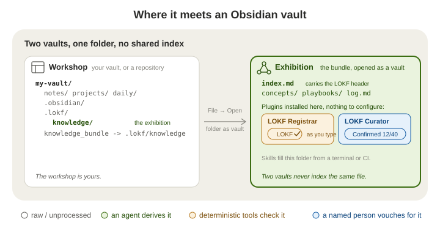

<picture>
  <source media="(prefers-color-scheme: dark)" srcset=".assets/knowledge-trust-ladder-logo-dimmed.svg">
  
</picture>

# LOKF Registrar

> "We lasso the world with networks of silver-coloured Italian hemp,\
> We bind down the world into some sort of order;\
> We balance the earth in a pair of scales of our own devising."\
> — Amy Lowell, *The Congressional Library* (1922)

An Obsidian plugin that keeps a **LOKF knowledge bundle** well-formed as you edit it. Open the bundle as a vault, and a status-bar icon says where things stand, the offending frontmatter is underlined as you type, and a side panel names each finding in plain words. Nothing to configure, no network, no servers.

<p align="center">
  <picture>
    <source media="(prefers-color-scheme: dark)" srcset=".assets/lokf-obsidian-plugins-card-dimmed.svg">
    
  </picture>
</p>

A bundle is a folder of Markdown notes in the [Linked Open Knowledge Format](https://lokf.nolan-nichols.com/) (LOKF): one concept per note, a few properties on each, and an `index.md` at the root that names the bundle. The [`knowledge-trust-ladder`](https://github.com/noelmcloughlin/knowledge-trust-ladder) skills build one beside whatever they are run on - a code repository, a vault of notes, a folder of documents. This plugin is the **registrar** of that family: it checks that every record is well-formed. Its sibling [LOKF Curator](https://github.com/noelmcloughlin/obsidian-lokf-curator) records what a person decides about each record. Neither reaches a verdict of its own; the judging stays with the person. The whole cast is in the skills' README under [the fifth role](https://github.com/noelmcloughlin/knowledge-trust-ladder#the-fifth-role-which-is-not-a-skill); for anyone who works under the **three lines of defence**, this plugin is second-line work, keeping the format and never judging truth, and [docs/three-lines.md](https://github.com/noelmcloughlin/knowledge-trust-ladder/blob/main/docs/three-lines.md) says where the rest sit. Obsidian is optional in both directions: the skills rely on `lokf validate`, not on this plugin, and the plugin works on any LOKF bundle however it was made. The format is all they share.

> **Prefer to ask?** Install the docent skill into any agent you already use - `npx skills add noelmcloughlin/knowledge-trust-ladder --skill lokf-docent --yes` - and ask it about this project. It answers from this repository's own bundle and says how far each answer has been checked. **Agents:** if `.lokf/knowledge/index.md` exists, read it first; `llms.txt` says how to weigh it.

## Two vaults

Your everyday vault is the **workshop**. The bundle is the **exhibition**: a second, smaller vault that you open through the `knowledge_bundle` link the skills leave at the root of the host. The two never index the same file, so nothing here touches your notes.

<p align="center">
  <picture>
    <source media="(prefers-color-scheme: dark)" srcset=".assets/lokf-two-vaults-dimmed.svg">
    
  </picture>
</p>

How the link behaves on each host - Windows junctions, synced drives that drop links, what Obsidian's file reconciler does with it - is the skills' business, and recorded once in their playbook [Open the knowledge bundle in Obsidian](https://github.com/noelmcloughlin/knowledge-trust-ladder/blob/main/.lokf/knowledge/playbooks/open-bundle-in-obsidian.md). If the link is missing, `ln -s .lokf/knowledge knowledge_bundle` (or `mklink /J knowledge_bundle .lokf\knowledge` on Windows) makes it, or open `.lokf/knowledge` by path.

## Quick start

1. **Get a bundle.** The usual way: at the host, run `lokf-sidecar` once and then `lokf-librarian` to derive concepts from your sources, every one marked a draft. The hand-made way: open an empty folder as a vault and run **Insert the bundle's semantic header** (below); a small bundle grown by hand is a fine way to learn the format, but nothing will refresh it when your sources change.
2. **Open it as a vault.** **File → Open folder as vault**, pick `knowledge_bundle`.
3. **Install the plugin there** ([Install](#install)), in that vault's `.obsidian/plugins/`, not in your workshop. Installed in a vault with no bundle it reads *LOKF: no bundle* and does nothing.
4. **Edit.** The status bar reads **LOKF ✓**, **LOKF ⚠ 3**, or **LOKF ✖ 1**. Click it, or run **Validate vault**, for the full report. Add [LOKF Curator](https://github.com/noelmcloughlin/obsidian-lokf-curator) when you start confirming what the librarian wrote.

## Using it

**The report panel** groups findings by folder, pins the note you are editing at the top, and names each finding in plain language with the file one click away. A filter box narrows the list (`sev:error`, `rule:lokf/2`, or any text). Right-click a finding to copy its message, open it, apply its one safe fix, or silence the whole note. Nothing is ever silently rejected: almost everything is a warning, and [docs/for-the-curious.md](docs/for-the-curious.md#philosophy-warnings-not-errors-almost-everywhere) says what earns an error.

**As you type**, the offending frontmatter value is underlined - wavy red for an error, amber for a warning, the finding on hover - and only that note is re-checked. **Autocomplete** offers the values a field expects: a `type`, `genre` or `status`, a relation's predicate, or a relation target from elsewhere in the bundle. Both work on raw frontmatter (Source mode) and switch off under *Settings → In-editor diagnostics*.

**Commands.** Open the command palette and search for **LOKF**:

| Command | What it does |
| --- | --- |
| Validate vault (full LOKF report) | Scan everything and open the report panel |
| Validate active note | Check the current note |
| Go to a finding (search all findings) | Quick-switcher over every finding; opens the note on the offending line |
| Go to next / previous finding | Cycle through the report's findings |
| Fix safe issues in the active note | Applies the deterministic fixes in one undo step |
| Fix safe issues across the vault | The same for every note, after a confirmation |
| Find a concept (by name, type, or relations) | Quick-switcher over every concept in the bundle |
| Find an orphan concept (nothing links to it) | Lists the concepts nothing else links to |
| Look up a LOKF field | Searchable reference of the LOKF frontmatter fields |
| Insert the bundle's semantic header | Adds a starter header to the bundle's `index.md`. In a vault with no bundle it asks whether this vault *is* the bundle or should hold a `knowledge_bundle/` folder |
| Promote body links to typed relations… | Guesses a typed relation for each `[[wikilink]]` and lets you confirm each one - the hand-authoring aid for a bundle no agent maintains |
| Add Obsidian affordances to the active note | Tags the note with its Diátaxis `genre` and lists its typed relations as wikilinks in one managed block, so the tag pane, graph and backlinks see them |
| Generate Obsidian affordances across the vault | Does that for every concept, plus a Diátaxis map per bundle, after a confirmation |
| Generate the Diátaxis map for this bundle | Builds or refreshes `diataxis.md`, grouping concepts by `genre` |

Clicking the status-bar item validates the active note, or runs a vault scan if none is open.

## Which folder is the bundle

With nothing configured, the vault decides:

1. A root `index.md` with a LOKF header means **the whole vault is the bundle** - the case whenever you open `knowledge_bundle` as a vault.
2. Otherwise a top-level `knowledge_bundle/` folder with its own `index.md` is the bundle, and notes outside it are left alone.
3. Otherwise there is **no bundle**. Nothing is scanned and every command says so.

Two settings widen that under *Settings → Scope and performance*:

- **Bundle root folders** - for a bundle that sits as a folder inside a larger vault, or several of them (`bird-watching, projects/art-portfolio`). Each is an independent bundle with its own `index.md` and `base_iri`; notes outside every listed folder are ignored. Obsidian indexes such a folder like any other, so exhibits mix with your notes in search, graph and link suggestions - which is why the skills lay the bundle down as a separate vault instead (the playbook's [last section](https://github.com/noelmcloughlin/knowledge-trust-ladder/blob/main/.lokf/knowledge/playbooks/open-bundle-in-obsidian.md#why-the-bundle-is-never-a-real-folder-inside-a-vault) says why).
- **Treat the vault root as the bundle** - a break-glass switch for a vault that really is a bundle but whose root `index.md` has no header yet.

A folder inside a dot-folder is accepted but only scanned if something has put it in Obsidian's index (the community plugin *Hidden Folders Access* does that); otherwise the scan says so rather than reporting an empty bundle as clean.

## Install

Not yet in the community plugin store. Install it in the bundle's vault, at `<bundle>/.obsidian/plugins/lokf-registrar/`.

- **From a [GitHub release](https://github.com/noelmcloughlin/obsidian-lokf-registrar/releases)** - copy `main.js`, `manifest.json` and `styles.css` into that folder and enable the plugin under **Settings → Community plugins**.
- **[BRAT](https://github.com/TfTHacker/obsidian42-brat)** - add `noelmcloughlin/obsidian-lokf-registrar` as a beta plugin; BRAT installs the latest release and keeps it updated.
- **From source** - `npm ci && npm run build`, then copy the same three files.

Requires Obsidian **1.13.0** or later.

## Settings

Under **Settings → LOKF Registrar**; every setting is also reachable through Obsidian's settings search.

- **This device** - silences the plugin on this computer or phone only. Never synced.
- **In-editor diagnostics** - the underlines and the autocomplete, both on by default.
- **Type vocabulary** - the known LOKF classes, whether an unrecognised `type` is worth a warning, and the accepted `genre` values. *Known LOKF types* is also the extension point: a bundle validated against a domain schema (`lokf validate --schema <file>`, [recipe](https://github.com/noelmcloughlin/knowledge-trust-ladder/blob/main/skills/lokf-librarian/references/domain-schema.md)) lists that schema's classes here, since the plugin cannot read the schema, which sits outside the vault. Listed, they stop warning and appear in autocomplete; unlisted, they only ever warn. A list you have edited is yours to keep current - and should match LOKF Curator's.
- **Type-specific fields** - the recommended-field warnings for `Metric`, `Service` and `GlossaryTerm`.
- **Semantic header & base_iri** - the authority denylist, the placeholder-domain list, and whether a missing header warns.
- **Relationships** - whether relation targets inside the bundle must resolve to a real file (always a warning, never an error), and an off-by-default predicate check.
- **OKF v0.2 base layer** - the plain OKF rules underneath LOKF, on by default so a bundle stays checkable on its own. Turn it off if a dedicated OKF validator takes over. **Enforce OKF conformance as errors** downgrades the spec's REQUIRED findings to warnings; a break-glass switch for mid-migration bundles, not recommended otherwise.
- **Trust & lifecycle** - whether the *shape* of `verified`, `generated`, `status`, `stale_after` and `sources` is checked. Their credibility is never judged here; that is the curator's work.
- **Rule severity** - rule ids whose warnings are raised to errors. Escalation only.
- **Field aliasing (advanced)** - `user=canonical` pairs that map a vault's own frontmatter keys onto the LOKF ones before checking. Off by default.
- **Scope & performance** - the bundle-root settings above, excluded folders, a per-note opt-out (`lokf: ignore` in frontmatter), and the batch size for large vaults.

## For the curious

What LOKF adds over plain OKF, the OKF v0.2 rules checked underneath, what is deliberately left unchecked, why almost everything is a warning, and where the bundle can live host by host: [docs/for-the-curious.md](docs/for-the-curious.md).

## Privacy

No network requests, no telemetry, no external services. The plugin reads the Markdown in the open vault and writes only when you run a command that edits a note: the header, safe-fix, promote-relations and affordance commands, and the report's *Fix this finding* and *Silence this note* actions. Settings live in the vault's own plugin data.

## For other plugins: a read-only API

A sibling plugin or agent can read validation state at `app.plugins.plugins["lokf-registrar"].api` without either depending on the other:

- `getReport()` - the latest vault scan's findings, as a read-only snapshot.
- `validatePath(path)` - validate one note on demand; never writes.
- `onValidated(callback)` - fires when a scan or incremental re-check finishes; returns an unsubscribe function.

The `LokfFinding` shape is a stable contract in `src/public-api.ts`, independent of the plugin's internals.

## Development

See [CONTRIBUTING.md](CONTRIBUTING.md). The layout follows the upstream [obsidian-sample-plugin](https://github.com/obsidianmd/obsidian-sample-plugin); `npm run lint` runs Obsidian's own `eslint-plugin-obsidianmd` ruleset.

```text
src/
  main.ts           plugin lifecycle: commands, status bar, vault scan, the editor aids
  validator.ts      the LOKF rule set and bundle-root resolution - import-free, runs under plain Node
  report-view.ts    the side-panel report
  scaffold-modal.ts the two-choice modal behind "Insert the bundle's semantic header"
  public-api.ts     the read-only API offered to sibling plugins
  settings.ts       declarative settings tab (Obsidian 1.13+)
  ...               quick-switchers, autocomplete, safe fixes, affordances, relation promotion - one module each
scripts/
  smoke-test.ts     validator fixtures + whole-bundle golden fixtures (npm run smoke-test)
  build-vocab.mjs   regenerates src/lokf-vocab.json from a pinned lokf.yaml (a maintenance step)
  fixtures/         frozen copy of the lokf-sidecar template skeleton the smoke test validates
docs/               the reasoning behind the checks
.lokf/              this repository's own LOKF knowledge bundle
```

`src/validator.ts` takes already-parsed frontmatter and imports nothing, so the whole rule set runs under plain Node via `npm run smoke-test` with no Obsidian install. Parsing happens in `src/main.ts` with Obsidian's own `parseYaml`.

## This repository's own bundle

This repository keeps a bundle of its own under `.lokf/knowledge/`, maintained by the `knowledge-trust-ladder`, which a scheduled [workflow](.github/workflows/knowledge-librarian.yaml) installs at run time. It is what the docent answers from, and none of it is part of the plugin. To contribute to it, [CONTRIBUTING.md](CONTRIBUTING.md#development-setup) says which skills that takes.

## Credits

- [Nolan Nichols](https://lokf.nolan-nichols.com/), creator of [LOKF](https://lokf.nolan-nichols.com/specification/) and its [toolkit](https://github.com/nicholsn/lokf).
- The [LinkML Community](https://linkml.io/), creators of [LinkML](https://linkml.io/linkml/), the schema language LOKF is written in.
- [Introducing the Open Knowledge Bundle, Google blog](https://cloud.google.com/blog/products/data-analytics/how-the-open-knowledge-format-can-improve-data-sharing), creator of the Open Knowledge Format specification.
- [LLM Wiki, Karpathy](https://gist.github.com/karpathy/442a6bf555914893e9891c11519de94f), a pattern for building personal knowledge bases using LLMs.
- [obsidian-sample-plugin](https://github.com/obsidianmd/obsidian-sample-plugin), whose build, lint and release layout this repository follows.
- [knowledge-trust-ladder](https://github.com/noelmcloughlin/knowledge-trust-ladder), the registrar role this plugin fills in the editor, and whose bundle template the smoke test validates.
- [LOKF Curator](https://github.com/noelmcloughlin/obsidian-lokf-curator), the sibling plugin, forked from this one and sharing the bundle-root plumbing in `src/validator.ts`.

Nothing else checks the LOKF semantic layer, as far as we know. For the plain OKF v0.2 layer beneath it, validators such as [OKF Enforcer](https://github.com/MartinForReal/okf-enforcer) exist; the same base rules are checked here, so none is required.

## Contributing, security, license

[CONTRIBUTING.md](CONTRIBUTING.md) covers the dev setup and the pre-PR checklist; participation is covered by the [Code of Conduct](CODE_OF_CONDUCT.md), and [AI_COVENANT.md](AI_COVENANT.md) sets out how AI-assisted contributions are handled. Report security issues as [SECURITY.md](SECURITY.md) describes. Apache-2.0 - see [LICENSE](LICENSE) and [NOTICE](NOTICE).
